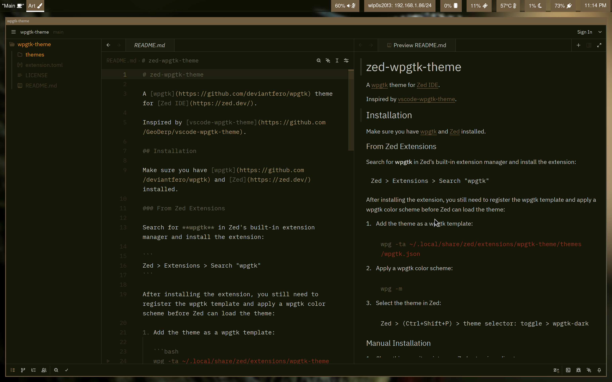

# zed-wpgtk-theme

A [wpgtk](https://github.com/deviantfero/wpgtk) theme for [Zed IDE](https://zed.dev/).

</br>



Inspired by [vscode-wpgtk-theme](https://github.com/GeoDerp/vscode-wpgtk-theme).

## Installation

Make sure you have [wpgtk](https://github.com/deviantfero/wpgtk) and [Zed](https://zed.dev/) installed.

### From Zed Extensions

Search for **wpgtk** in Zed's built-in extension manager and install the extension:

```
Zed > Extensions > Search "wpgtk"
```

After installing the extension, you still need to register the wpgtk template and apply a wpgtk color scheme before Zed can load the theme:

1. Add the theme as a wpgtk template:

   ```bash
   wpg -ta ~/.local/share/zed/extensions/wpgtk-theme/themes/wpgtk.json
   ```

2. Apply a wpgtk color scheme:

   ```bash
   wpg -m
   ```

3. Select the theme in Zed:

   ```
   Zed > (Ctrl+Shift+P) > theme selector: toggle > wpgtk-dark
   ```

### Manual Installation

1. Clone this repository into your Zed extensions directory:

   ```bash
   git clone https://github.com/GeoDerp/zed-wpgtk-theme \
     ~/.local/share/zed/extensions/wpgtk-theme
   ```

2. Add the theme as a wpgtk template:

   ```bash
   wpg -ta ~/.local/share/zed/extensions/wpgtk-theme/themes/wpgtk.json
   ```

3. Apply a wpgtk color scheme:

   ```bash
   wpg -m
   ```

4. Select the theme in Zed:

   ```
   Zed > (Ctrl+Shift+P) > theme selector: toggle > wpgtk-dark
   ```

> **Note:** After selecting a new wallpaper in wpgtk, Zed should pick up the updated theme automatically once `wpg -m` is run.
